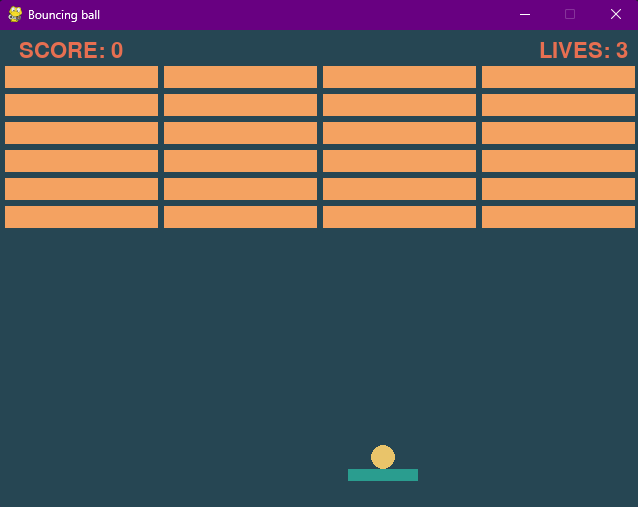

# Breakout

Simple game made with pygame, based on a [udemy tutorial](https://www.udemy.com/course/pygame-breakout), with so many modifications its a full refactor and re-write of the thing

Also code quality is pretty bad ok i did this in like 2.5 days (counting midnight) because my dumbass decided to drink coffee at 11pm 🫠

### Things to do that I am too lazy or dumb to do:
- [ ] Refactor Code by doing some kind of scene manager
- [ ] Add a Menu
- [ ] Multi-level design
